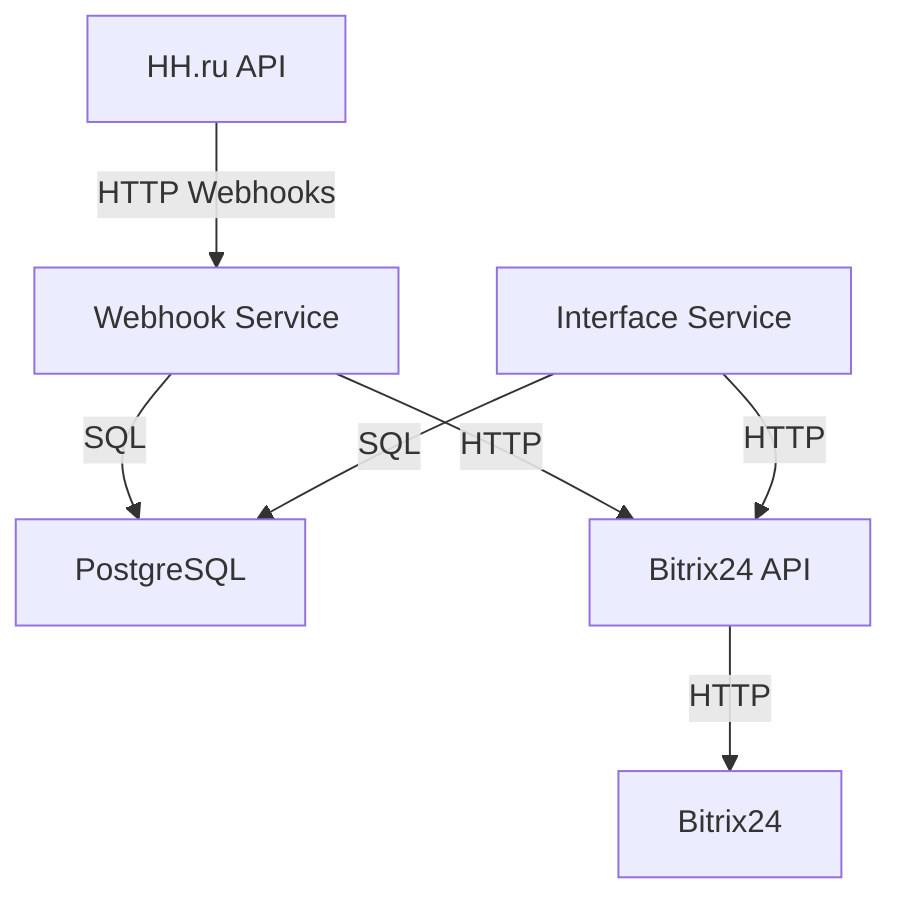

# 🔄 Интеграция HH.ru → Bitrix24: Автоматизация рекрутинга
**Продакшен-решение для 600+ HR-команд**  

## Обзор проекта
Проект направлен на автоматизацию процессов рекрутинга через интеграцию HH.ru — одного из ведущих порталов по поиску работы — с Bitrix24, многофункциональной платформой для управления CRM и проектами. Основная цель — устранить ручной ввод данных, ускорить обработку откликов кандидатов и повысить эффективность работы HR-менеджеров. Система автоматически переносит данные об откликах с HH.ru в Bitrix24, а также включает дополнительные инструменты, такие как Chrome-расширение для импорта резюме в один клик, что делает процесс управления кандидатами еще удобнее.

## Архитектура системы

## Ключевые компоненты
- **HH.ru API** - внешний сервис, который отправляет вебхуки с данными об откликах на вакансии.
- **Webhook Service** - микросервис, принимающий вебхуки от HH.ru, обрабатывающий данные отклика и отправляющий их в Bitrix24.
- **Interface Service** - микросервис, предоставляющий интерфейс для приложения внутри Bitrix24, позволяющий загружать пользователей и получать данные о вакансиях.
- **Bitrix24 API** - API для взаимодействия с Bitrix24, через которое создаются отклики и выполняются другие операции.
- **PostgreSQL** - база данных для хранения настроек, привязок вакансий к порталам Bitrix24 и другой информации.

## Моя роль в проекте
Я был единственным бэкенд-разработчиком в этом проекте и отвечал за его создание с нуля — от идеи до запуска в продакшен. Это был мой первый крупный проект на позиции junior`а, и он стал для меня важным испытанием и возможностью проявить себя.

**Что я делал**
Работа началась с анализа API HH.ru и Bitrix24. Мне пришлось глубоко изучить документацию и провести тесты, чтобы разобраться в их особенностях. На основе этого я разработал архитектуру системы, выделив два основных компонента:

- **Interface Service** — RESTful API для связи с интерфейсом и обработки запросов от HR-специалистов.
- **Event Processor** — фоновый сервис для обработки событий, спокойно выдеживающий нагрузку, которая может доходить до 20к событий в день.
- Также я подготовил техническое задание для себя и фронтенд-разработчиков, разбил задачи на квартальные спринты и следил за их выполнением.

**Проблемы и их решение**
В процессе работы возникали сложности. Например, в продакшене запросы перестали обрабатываться из-за исчерпания пула соединений с базой данных. Причина крылась в избыточном создании сервером рабочих потоков. Я оперативно увеличил лимит соединений и настроил мониторинг, чтобы избежать подобных проблем в будущем. Этот случай научил меня внимательнее подходить к управлению ресурсами.

**Дополнительные задачи**
Кроме основной разработки, я занимался деплоем системы, писал документацию и опубликовал приложение в маркетплейсе. Также в рамках этого проекта разработал Chrome-расширение для импорта резюме.

**Итог**
Проект успешно запустили, и он теперь помогает HR-командам автоматизировать рекрутинг, интегрируя HH.ru и Bitrix24. Система обрабатывает большие объемы данных и готова к дальнейшему масштабированию.

**Что я вынес из проекта**
Этот опыт стал для меня серьезным шагом вперед. Я научился управлять проектом целиком, решать сложные технические задачи и работать с реальными бизнес-потребностями. Результат моей работы — это не просто код, а система, которая реально облегчает жизнь пользователям.

## Технологии, используемые в проекте

