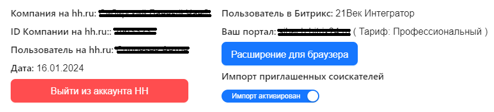
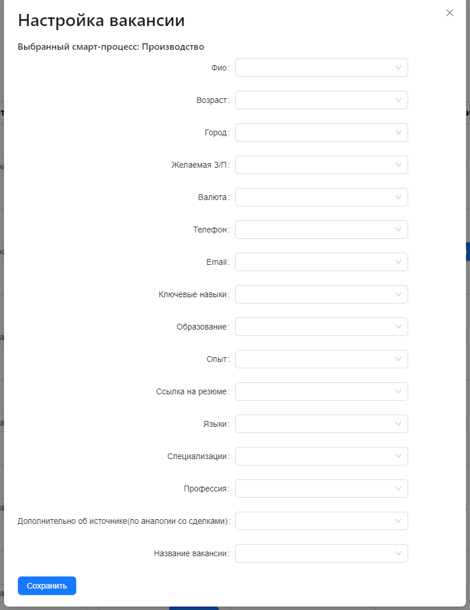
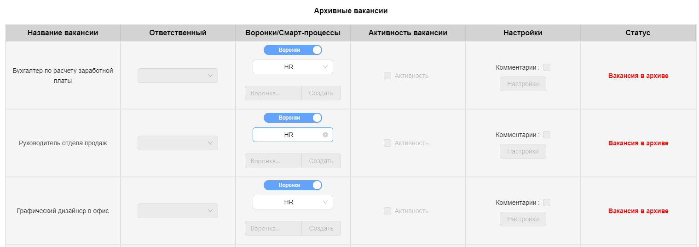

# Интеграция HH.ru + Bitrix24

## Описание проекта

Проект заключается в интеграции сервиса **HeadHunter** с платформой **Bitrix24**. Эта интеграция обеспечивает удобную работу с резюме, полученными с портала hh.ru, непосредственно через CMS Bitrix, и наоборот.

### Основные функции интеграции:

1. **Работа с вакансиями:**
   - Назначение ответственного за вакансии.
   - Создание и выбор воронок в Bitrix24.
   - Создание и выбор смарт-процессов для вакансий.

2. **Импорт резюме:**
   - Расширение, позволяющее импортировать резюме из hh.ru в Bitrix24.

3. **Умные поля:**
   - Возможность создавать умные поля в Bitrix24, используя данные из HeadHunter.
   - Импорт полей в комментарии.

4. **Дополнительные функции:**
   - Отображение архивных вакансий с отключенным функционалом.
   - Показ полной информации о пользователях hh.ru и Bitrix24.
   - Авторизация на обоих порталах.
   - Кнопка для включения/выключения импорта резюме.
   - Генерация случайного кода для привязки расширения к HeadHunter.

### Особенности:

- Функционал к смарт-процессам доступен только при определенных тарифах.
- Возможность разлогиниться из системы.

Проект направлен на упрощение процесса работы с вакансиями и резюме, обеспечивая гладкую интеграцию между двумя важными платформами рекрутинга и управления задачами.

## Назначение проекта 🎯

Проект интеграции сервиса **HeadHunter** с платформой **Bitrix24** был создан с целью решения ряда ключевых проблем и удовлетворения конкретных потребностей в области управления человеческими ресурсами.

### Зачем был создан этот проект:

1. **Упрощение процесса рекрутинга** 💼:
   - Облегчение поиска и управления кандидатами, уменьшение времени на обработку резюме.

2. **Централизация рабочего процесса** 🌐:
   - Интеграция двух ключевых платформ обеспечивает единый рабочий интерфейс для HR-специалистов.

3. **Автоматизация рутинных задач** 🤖:
   - Автоматический импорт резюме и синхронизация данных между платформами сокращает время на рутинные операции.

4. **Повышение эффективности взаимодействия с вакансиями** 📈:
   - Легкий доступ к информации о вакансиях, управление кандидатами и воронками отбора в одном месте.

5. **Гибкость и масштабируемость** 🌟:
   - Решение адаптируется под разные бизнес-процессы и может масштабироваться в зависимости от нужд компании.

Проект призван оптимизировать процесс найма, улучшая взаимодействие между HR-отделом и потенциальными сотрудниками, а также обеспечивая более эффективное управление человеческими ресурсами.

## Галерея

...

## Моя роль в проекте
Мне предстояло продумать всю логику проекта, просчитать сколько необходимо end points для полного функционала приложения, выстроить логику и архитектуру для написания back-end и дальше я еще пишу

## Технологии, используемые в проекте

## Принципы и инструменты разработки
- Код-стиль и форматирование: Prettier
- Линтер: ESLint (с конкретными правилами, если необходимо уточнить)
- Система контроля версий: Git (с применением GitFlow или другой стратегии, если применимо)
- Прочие инструменты: (например, Webpack, Babel, etc.)

## Команда
- Общее количество человек: 3
- Роли в команде:
  - Front-end Developer: 1
  - Back-end Developer: 1
  - Team-Lead: 1

## Основные достижения и результаты
В процессе работы над этим проектом в роли Backend-разработчика мной были достигнуты следующие ключевые результаты:

Успешная интеграция: Мной была успешно выполнена интеграция между "HH.ru" и Битрикс24, что позволило эффективно синхронизировать данные между двумя системами на серверной стороне. 🔄

Улучшение производительности системы: Благодаря оптимизации запросов и использованию эффективных алгоритмов обработки данных, производительность серверной части значительно улучшилась. 🚀

Автоматизация процессов: Разработка и внедрение скриптов для автоматизации рутинных задач, таких как проверка авторизации и управление вакансиями, существенно улучшила рабочие процессы. ⚙️

Повышение безопасности: Усиление мер безопасности, включая шифрование данных и улучшенную систему аутентификации, повысило надежность и безопасность платформы. 🛡️

Оптимизация архитектуры: Применение принципов чистой архитектуры и микросервисного подхода способствовало созданию более гибкой и масштабируемой системы. 🛠️

Ускорение времени ответа сервера: Оптимизация запросов к базе данных и использование кэширования значительно сократили время ответа сервера на запросы пользователей. ⏱️

Положительный фидбек от пользователей: Разработанные серверные решения были хорошо приняты пользователями, что отразилось в повышении их удовлетворенности и лояльности к продукту. 👍

Эти достижения стали возможны благодаря тесному сотрудничеству с командой Front-end разработчиков, а также моему личному вкладу в разработку и оптимизацию серверной части проекта.

1. **Сложности с интеграцией:**
   - Первоначально процесс интеграции "HH.ru" и Битрикс24 представлял собой сложную задачу из-за различий в их API.
   - Мы решили эту проблему, тщательно изучив документацию обоих сервисов и применив адаптеры для преобразования данных.

2. **Высокая нагрузка на сервер:**
   - Большое количество одновременных запросов к API могло привести к перегрузке сервера.
   - Мы оптимизировали код, чтобы уменьшить количество запросов и реализовали кеширование для снижения нагрузки.

## Ссылки
- Демо проекта: Полная версия скоро появится на маркетплейс Bitrix24
- Код проекта: На данный момент, из-за ограничений, связанных с неразглашением информации (НДА), код проекта не может быть общедоступным.

Я придерживаюсь политики конфиденциальности и соблюдаю соглашения о неразглашении, поэтому кода проекта нет в общем доступе.
Если у вас есть вопросы относительно кода или функциональности проекта, пожалуйста, свяжитесь со мной напрямую, и я постараюсь предоставить необходимую информацию
